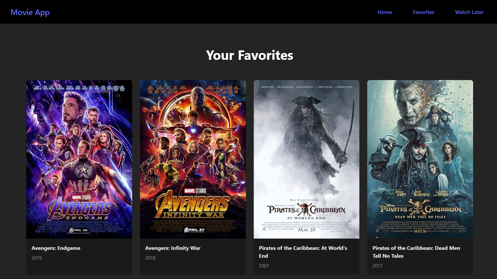

# 🎬 Movie Explorer App

A simple React-based movie application that lets users search for movies using the OMDb API. Users can also add movies to their **Favorites** and **Watch Later** lists, which are saved in local storage for persistence.

---

## 🚀 Features

- 🔍 Search movies via the OMDb API
- ❤️ Add and remove movies from Favorites
- 🕒 Add movies to a Watch Later list
- 💾 LocalStorage persistence
- ⚙️ React Context API for global state
- 💅 Clean UI with responsive design

---

## 📸 Screenshots
)
[favorites]()

---

## 🛠️ Tech Stack

- [React.js](https://react.dev/)
- [React Router DOM](https://reactrouter.com/)
- [OMDb API](https://www.omdbapi.com/)
- [CSS](https://developer.mozilla.org/en-US/docs/Web/CSS)
- React Context API

---

## 🔧 Setup Instructions

1. **Clone the Repository**

